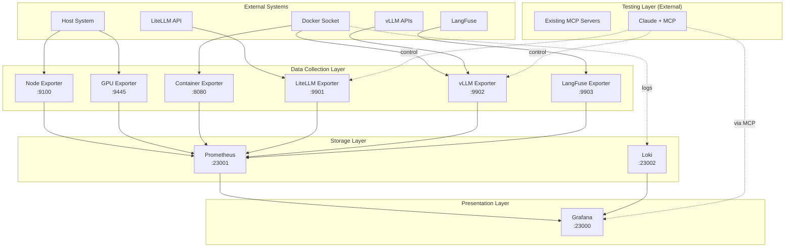

# Components

The monitoring system is composed of several logical components that work together to provide comprehensive LLM infrastructure monitoring.

## Component List

### Prometheus Server
**Responsibility:** Time-series metrics storage and query engine

**Key Interfaces:**
- HTTP API on port 23001 for queries
- Scrape endpoints for metric collection
- Alert manager integration (future)

**Dependencies:** None (root component)

**Technology Stack:** Prometheus 2.x running in Docker container with 30-day retention

### Grafana Server
**Responsibility:** Visualization layer and dashboard management

**Key Interfaces:**
- Web UI on port 23000
- REST API for dashboard provisioning
- Data source query APIs

**Dependencies:** Prometheus, Loki

**Technology Stack:** Latest Grafana in Docker with volume-based persistence

### Loki Server
**Responsibility:** Log aggregation and storage

**Key Interfaces:**
- Push API on port 23002 for log ingestion
- LogQL query API
- Promtail integration

**Dependencies:** None (root component)

**Technology Stack:** Loki 2.x with 30-day log retention

### Node Metrics Exporter
**Responsibility:** Collect system-level metrics (CPU, memory, disk, network)

**Key Interfaces:**
- Prometheus metrics endpoint on port 9100
- Health check endpoint

**Dependencies:** Host system access

**Technology Stack:** Python 3.12 + FastAPI + prometheus_client

### GPU Metrics Exporter
**Responsibility:** Collect NVIDIA GPU metrics for all 8 H200 GPUs

**Key Interfaces:**
- Prometheus metrics endpoint on port 9445
- GPU process information API
- Health check endpoint

**Dependencies:** NVIDIA drivers, DCGM

**Technology Stack:** Python 3.12 + FastAPI + py3nvml/dcgm-exporter

### Container Metrics Exporter
**Responsibility:** Monitor Docker container resource usage

**Key Interfaces:**
- Prometheus metrics endpoint on port 8080
- Container listing API
- cAdvisor-compatible metrics

**Dependencies:** Docker socket access

**Technology Stack:** Python 3.12 + FastAPI + docker-py

### LiteLLM Metrics Exporter
**Responsibility:** Track LiteLLM proxy metrics and model availability

**Key Interfaces:**
- Prometheus metrics endpoint on port 9901
- Model status API (/api/v1/models)
- Mock scenario control API

**Dependencies:** LiteLLM API endpoint (configurable)

**Technology Stack:** Python 3.12 + FastAPI + httpx for API calls

### vLLM Metrics Exporter
**Responsibility:** Monitor vLLM containers and model performance

**Key Interfaces:**
- Prometheus metrics endpoint on port 9902
- Container status API with version info
- Model-to-GPU mapping API

**Dependencies:** Docker API, vLLM endpoints

**Technology Stack:** Python 3.12 + FastAPI + docker-py

### LangFuse Metrics Exporter
**Responsibility:** Extract analytics data from LangFuse

**Key Interfaces:**
- Prometheus metrics endpoint on port 9903
- Usage analytics API

**Dependencies:** LangFuse API or database access

**Technology Stack:** Python 3.12 + FastAPI + LangFuse SDK or SQLAlchemy

### Test Orchestration (Using Existing MCP Servers)
**Responsibility:** Enable AI-driven testing using existing MCP servers

**Key Interfaces:**
- Playwright MCP for browser control
- Screenshot MCP for visual captures
- Filesystem MCP for test artifacts
- Mock exporter APIs for scenario control

**Dependencies:** Existing MCP servers, Grafana, Mock exporters

**Technology Stack:** MCP configuration + Claude orchestration (no custom development)

### Mock Data Generator
**Responsibility:** Generate realistic metrics for Phase 1 development

**Key Interfaces:**
- All standard exporter endpoints
- Scenario configuration API
- Pattern generation controls

**Dependencies:** Configuration files

**Technology Stack:** Python 3.12 + FastAPI + NumPy for pattern generation

## Component Interaction Diagram



## Component Deployment Strategy

All components are deployed as Docker containers managed by Docker Compose:

```yaml