# Core Workflows

Key system workflows illustrating component interactions for primary use cases.

## Metric Collection Workflow

## GPU Alert Workflow

```mermaid
sequenceDiagram
    participant GE as GPU Exporter
    participant P as Prometheus
    participant G as Grafana
    participant U as User

    GE->>GE: Detect GPU temp > 85°C
    GE->>P: Export metric nvidia_gpu_temperature_celsius{gpu_id="0"} 87
    
    P->>P: Evaluate alert rules
    P->>P: Trigger GPU_HIGH_TEMP alert
    
    G->>P: Query alert status
    P-->>G: Return active alerts
    
    G->>G: Update dashboard
    G->>G: Show alert banner
    G-->>U: Display critical alert
```

## vLLM Container Discovery Workflow

## Mock Data Scenario Change Workflow

## AI-Driven Test Execution Workflow

## Log Collection Workflow

## Model Metadata Enrichment Workflow

## Dashboard Auto-Discovery Workflow (for Testing)

These workflows demonstrate the key interactions between components, showing both normal operations and special scenarios like testing and alerting.
