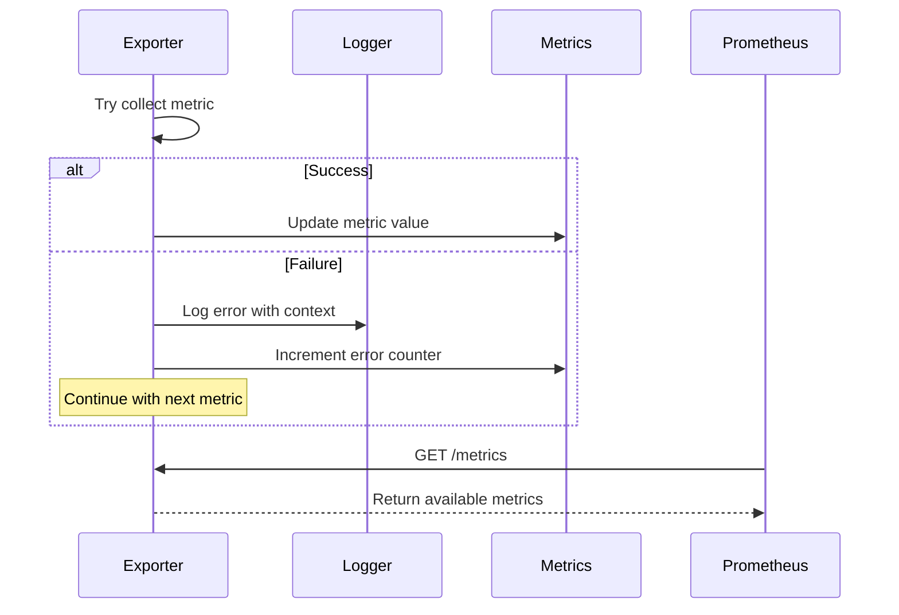

# Error Handling Strategy

Define unified error handling across the monitoring system.

## Error Flow


```mermaid
sequenceDiagram
    participant E as Exporter
    participant L as Logger
    participant M as Metrics
    participant P as Prometheus
    
    E->>E: Try collect metric
    alt Success
        E->>M: Update metric value
    else Failure
        E->>L: Log error with context
        E->>M: Increment error counter
        Note over E: Continue with next metric
    end
    
    P->>E: GET /metrics
    E-->>P: Return available metrics
```

## Error Response Format

```python