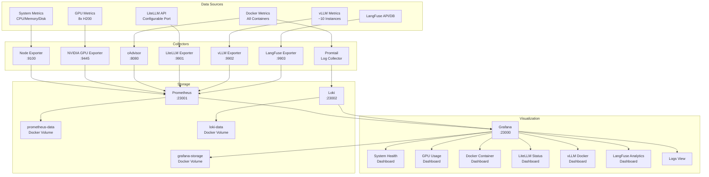

# High Level Architecture

## Technical Summary

The LLM Server Monitoring System is a containerized monitoring solution deployed on Ubuntu 24.04, utilizing Prometheus for metrics collection and Grafana for visualization. The architecture follows a pull-based monitoring pattern where Prometheus scrapes metrics from various exporters at 30-second intervals. The system monitors 8 H200 GPUs, ~10 vLLM containers with varying versions, system resources, and LLM-specific metrics. All components run as Docker containers orchestrated via Docker Compose, with Python 3.12-based custom exporters using Dynaconf for configuration management. The solution operates entirely on an internal network with basic authentication, designed for single-maintainer use with periodic dashboard refresh suitable for the 10-20 requests/minute workload.

## Platform and Infrastructure Choice

**Platform:** On-premise Ubuntu 24.04 Server
**Key Services:** Docker Engine with Compose plugin, NVIDIA Container Toolkit, Prometheus, Grafana, Loki
**Deployment Host and Regions:** Single server deployment, internal network only

## Repository Structure

**Structure:** Monorepo with Docker Compose orchestration
**Monorepo Tool:** Not applicable - single repository with docker-compose.yml
**Package Organization:** 
- `/exporters` - Custom Python exporters
- `/config` - Prometheus, Grafana, Loki configurations  
- `/dashboards` - Grafana dashboard JSON files
- `/docker` - Dockerfiles for custom components
- `/scripts` - Utility and setup scripts

## High Level Architecture Diagram

## Architectural Patterns

- **Pull-Based Monitoring:** Prometheus actively scrapes metrics from exporters - *Rationale:* Simplifies firewall rules and provides consistent collection intervals
- **Exporter Pattern:** Each data source has dedicated exporter - *Rationale:* Separation of concerns and independent scaling
- **Time-Series Storage:** Prometheus for metrics, Loki for logs - *Rationale:* Purpose-built databases for each data type
- **Container-First Design:** All components run as Docker containers - *Rationale:* Consistent deployment and easy updates
- **Configuration as Code:** Dynaconf for Python apps, environment variables for containers - *Rationale:* Flexible configuration management with override capability
- **Single Pane of Glass:** Grafana as unified visualization layer - *Rationale:* Reduces context switching for monitoring tasks
- **Volume-Based Persistence:** Docker volumes for all stateful data - *Rationale:* Data survives container restarts and enables backups
