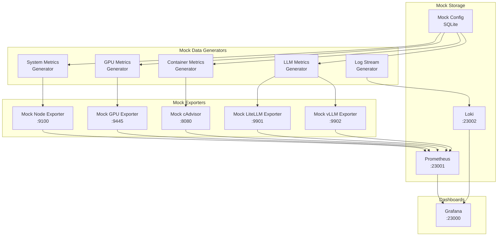

# Mock Data Architecture (Phase 1)

Phase 1 focuses on dashboard development using simulated data, allowing UI creation and testing without real infrastructure dependencies.

## Mock Data Strategy



## Mock Data Components

### 1. Mock Prometheus Exporters

**Base Mock Exporter (Python)**
```python
from fastapi import FastAPI
from prometheus_client import Gauge, generate_latest, CONTENT_TYPE_LATEST
from dynaconf import Dynaconf
import random
import math
import time

settings = Dynaconf(settings_files=['settings.yaml', '.env'])

class MockExporter:
    def __init__(self, port: int):
        self.app = FastAPI()
        self.port = port
        self.base_time = time.time()
        self.setup_routes()
    
    def setup_routes(self):
        @self.app.get('/metrics')
        async def metrics():
            return Response(generate_latest(), media_type=CONTENT_TYPE_LATEST)
    
    def generate_realistic_value(self, base: float, variance: float, 
                                period_minutes: float = 60) -> float:
        """Generate realistic time-based values with patterns"""
        elapsed = (time.time() - self.base_time) / 60  # minutes
        
        # Daily pattern (sine wave)
        daily_factor = math.sin(2 * math.pi * elapsed / (24 * 60))
        
        # Hourly pattern (smaller sine wave)
        hourly_factor = math.sin(2 * math.pi * elapsed / 60) * 0.3
        
        # Random noise
        noise = random.uniform(-variance, variance)
        
        # Occasional spikes
        spike = random.random()
        if spike > 0.98:  # 2% chance of spike
            noise *= 3
        
        return base + (daily_factor * variance) + (hourly_factor * variance) + noise
```

### 2. Mock System Metrics Generator

```python
class MockSystemMetricsExporter(MockExporter):
    def __init__(self):
        super().__init__(9100)
        
        # Define metrics
        self.cpu_usage = Gauge('node_cpu_usage_percent', 'CPU usage percentage')
        self.memory_used = Gauge('node_memory_used_bytes', 'Memory used in bytes')
        self.memory_total = Gauge('node_memory_total_bytes', 'Total memory in bytes')
        self.disk_used = Gauge('node_disk_used_bytes', 'Disk used in bytes')
        self.disk_total = Gauge('node_disk_total_bytes', 'Total disk in bytes')
        self.network_rx = Gauge('node_network_receive_bytes_total', 'Network RX bytes')
        self.network_tx = Gauge('node_network_transmit_bytes_total', 'Network TX bytes')
        self.load_1m = Gauge('node_load1', '1 minute load average')
        self.load_5m = Gauge('node_load5', '5 minute load average')
        self.load_15m = Gauge('node_load15', '15 minute load average')
        
        # Start background updater
        self.start_updater()
    
    def update_metrics(self):
        # CPU: 20-40% base load with variance
        self.cpu_usage.set(self.generate_realistic_value(30, 10))
        
        # Memory: 64GB total, 20-40GB used
        self.memory_total.set(64 * 1024**3)
        self.memory_used.set(self.generate_realistic_value(30 * 1024**3, 10 * 1024**3))
        
        # Disk: 1TB total, 200-400GB used
        self.disk_total.set(1024 * 1024**3)
        self.disk_used.set(self.generate_realistic_value(300 * 1024**3, 100 * 1024**3))
        
        # Network: Increasing counters
        self.network_rx.inc(random.randint(1000, 10000))
        self.network_tx.inc(random.randint(500, 5000))
        
        # Load averages
        base_load = self.generate_realistic_value(2, 0.5)
        self.load_1m.set(base_load + random.uniform(-0.2, 0.2))
        self.load_5m.set(base_load)
        self.load_15m.set(base_load - random.uniform(0, 0.2))
```

### 3. Mock GPU Metrics Generator

```python
class MockGPUExporter(MockExporter):
    def __init__(self):
        super().__init__(9445)
        self.num_gpus = 8  # 8x H200 GPUs
        
        # Define metrics with labels
        self.gpu_utilization = Gauge('nvidia_gpu_utilization', 'GPU utilization', ['gpu_id'])
        self.gpu_memory_used = Gauge('nvidia_gpu_memory_used_bytes', 'GPU memory used', ['gpu_id'])
        self.gpu_memory_total = Gauge('nvidia_gpu_memory_total_bytes', 'GPU memory total', ['gpu_id'])
        self.gpu_temperature = Gauge('nvidia_gpu_temperature_celsius', 'GPU temperature', ['gpu_id'])
        self.gpu_power = Gauge('nvidia_gpu_power_watts', 'GPU power consumption', ['gpu_id'])
        
        # GPU process tracking
        self.gpu_processes = {}
        self.init_gpu_processes()
    
    def init_gpu_processes(self):
        """Simulate vLLM containers using GPUs"""
        vllm_models = [
            ("vllm-llama3-70b", [0, 1], 60 * 1024**3),  # 60GB
            ("vllm-mixtral-8x7b", [2, 3], 50 * 1024**3),  # 50GB
            ("vllm-qwen2-72b", [4, 5], 65 * 1024**3),  # 65GB
            ("vllm-llama3-8b", [6], 16 * 1024**3),  # 16GB
            ("vllm-phi3-mini", [7], 8 * 1024**3),  # 8GB
        ]
        
        for container, gpu_ids, memory in vllm_models:
            for gpu_id in gpu_ids:
                self.gpu_processes[gpu_id] = {
                    'container': container,
                    'memory': memory // len(gpu_ids),
                    'utilization_impact': random.uniform(40, 80)
                }
    
    def update_metrics(self):
        for gpu_id in range(self.num_gpus):
            # Base utilization from processes
            base_util = self.gpu_processes.get(gpu_id, {}).get('utilization_impact', 10)
            utilization = self.generate_realistic_value(base_util, 15)
            self.gpu_utilization.labels(gpu_id=str(gpu_id)).set(min(100, max(0, utilization)))
            
            # Memory (80GB total for H200)
            total_memory = 80 * 1024**3
            process_memory = self.gpu_processes.get(gpu_id, {}).get('memory', 0)
            overhead_memory = self.generate_realistic_value(2 * 1024**3, 500 * 1024**2)
            used_memory = process_memory + overhead_memory
            
            self.gpu_memory_total.labels(gpu_id=str(gpu_id)).set(total_memory)
            self.gpu_memory_used.labels(gpu_id=str(gpu_id)).set(min(total_memory, used_memory))
            
            # Temperature (correlated with utilization)
            base_temp = 40 + (utilization * 0.4)  # 40°C idle, up to 80°C at 100%
            temp = self.generate_realistic_value(base_temp, 3)
            self.gpu_temperature.labels(gpu_id=str(gpu_id)).set(min(85, max(30, temp)))
            
            # Power (correlated with utilization)
            base_power = 100 + (utilization * 3)  # 100W idle, up to 400W
            power = self.generate_realistic_value(base_power, 20)
            self.gpu_power.labels(gpu_id=str(gpu_id)).set(min(450, max(50, power)))
```

### 4. Mock LLM Metrics Generator

```python
class MockLLMExporter(MockExporter):
    def __init__(self, provider: str, port: int):
        super().__init__(port)
        self.provider = provider
        
        # Define LLM-specific metrics
        self.model_requests = Gauge('llm_model_requests_per_minute', 
                                   'Requests per minute', ['model', 'type'])
        self.model_tokens_input = Gauge('llm_model_tokens_input_per_minute', 
                                       'Input tokens per minute', ['model'])
        self.model_tokens_output = Gauge('llm_model_tokens_output_per_minute', 
                                        'Output tokens per minute', ['model'])
        self.model_latency = Gauge('llm_model_latency_ms', 
                                  'Average latency in ms', ['model'])
        self.model_errors = Gauge('llm_model_errors_per_minute', 
                                 'Errors per minute', ['model'])
        
        self.init_models()
    
    def init_models(self):
        if self.provider == "litellm":
            self.models = {
                "gpt-4": {"type": "llm", "base_rpm": 5},
                "claude-3-opus": {"type": "llm", "base_rpm": 3},
                "llama3-70b": {"type": "llm", "base_rpm": 10},
                "text-embedding-3": {"type": "embedding", "base_rpm": 50},
                "bge-reranker": {"type": "reranker", "base_rpm": 30}
            }
        else:  # vllm
            self.models = {
                "llama3-70b": {"type": "llm", "base_rpm": 8, "container": "vllm-llama3-70b"},
                "mixtral-8x7b": {"type": "llm", "base_rpm": 12, "container": "vllm-mixtral-8x7b"},
                "qwen2-72b": {"type": "llm", "base_rpm": 6, "container": "vllm-qwen2-72b"},
                "llama3-8b": {"type": "llm", "base_rpm": 20, "container": "vllm-llama3-8b"},
                "phi3-mini": {"type": "llm", "base_rpm": 30, "container": "vllm-phi3-mini"}
            }
    
    def update_metrics(self):
        for model_name, config in self.models.items():
            # Request rate with realistic patterns
            base_rpm = config['base_rpm']
            rpm = self.generate_realistic_value(base_rpm, base_rpm * 0.3)
            self.model_requests.labels(model=model_name, type=config['type']).set(max(0, rpm))
            
            # Token rates (correlated with request rate)
            if config['type'] == 'llm':
                input_tokens = rpm * random.uniform(100, 500)  # 100-500 tokens per request
                output_tokens = rpm * random.uniform(50, 200)   # 50-200 tokens per response
                latency = self.generate_realistic_value(200, 50)  # 200ms base latency
            elif config['type'] == 'embedding':
                input_tokens = rpm * random.uniform(50, 200)
                output_tokens = 0  # Embeddings don't generate tokens
                latency = self.generate_realistic_value(50, 10)
            else:  # reranker
                input_tokens = rpm * random.uniform(200, 1000)
                output_tokens = 0
                latency = self.generate_realistic_value(100, 20)
            
            self.model_tokens_input.labels(model=model_name).set(max(0, input_tokens))
            self.model_tokens_output.labels(model=model_name).set(max(0, output_tokens))
            self.model_latency.labels(model=model_name).set(max(1, latency))
            
            # Error rate (occasional)
            error_rate = 0
            if random.random() > 0.95:  # 5% chance of errors
                error_rate = random.uniform(0.1, 2)
            self.model_errors.labels(model=model_name).set(error_rate)
```

### 5. Mock Container Metrics Generator

```python
class MockContainerExporter(MockExporter):
    def __init__(self):
        super().__init__(8080)
        
        # Define container metrics
        self.container_cpu = Gauge('container_cpu_usage_seconds_total', 
                                  'Container CPU usage', ['name', 'image'])
        self.container_memory = Gauge('container_memory_usage_bytes', 
                                     'Container memory usage', ['name', 'image'])
        self.container_network_rx = Gauge('container_network_receive_bytes_total', 
                                         'Container network RX', ['name'])
        self.container_network_tx = Gauge('container_network_transmit_bytes_total', 
                                         'Container network TX', ['name'])
        
        self.init_containers()
    
    def init_containers(self):
        self.containers = [
            # vLLM containers with versions
            {"name": "vllm-llama3-70b", "image": "vllm/vllm-openai:v0.4.2", "gpu": True},
            {"name": "vllm-mixtral-8x7b", "image": "vllm/vllm-openai:v0.4.1", "gpu": True},
            {"name": "vllm-qwen2-72b", "image": "vllm/vllm-openai:v0.4.3", "gpu": True},
            {"name": "vllm-llama3-8b", "image": "vllm/vllm-openai:v0.4.2", "gpu": True},
            {"name": "vllm-phi3-mini", "image": "vllm/vllm-openai:v0.4.0", "gpu": True},
            
            # Non-GPU containers
            {"name": "litellm-proxy", "image": "ghcr.io/berriai/litellm:v1.35.0", "gpu": False},
            {"name": "prometheus", "image": "prom/prometheus:v2.45.0", "gpu": False},
            {"name": "grafana", "image": "grafana/grafana:latest", "gpu": False},
            {"name": "loki", "image": "grafana/loki:2.9.0", "gpu": False},
            {"name": "promtail", "image": "grafana/promtail:2.9.0", "gpu": False},
            {"name": "langfuse", "image": "langfuse/langfuse:latest", "gpu": False},
        ]
```

## Mock Data Configuration

**settings.yaml**
```yaml
mock_data:
  # Scenario configurations
  scenarios:
    normal:
      description: "Normal operating conditions"
      cpu_load: 30
      gpu_utilization: 60
      error_rate: 0.1
    
    high_load:
      description: "High load scenario"
      cpu_load: 80
      gpu_utilization: 90
      error_rate: 0.5
    
    degraded:
      description: "Degraded performance"
      cpu_load: 50
      gpu_utilization: 70
      error_rate: 5.0
  
  # Time patterns
  patterns:
    daily_cycle: true
    hourly_spikes: true
    random_anomalies: true
    anomaly_frequency: 0.02  # 2% chance
  
  # Model configurations
  models:
    request_multiplier: 1.0  # Scale all request rates
    latency_multiplier: 1.0  # Scale all latencies
    error_injection: false   # Inject random errors
