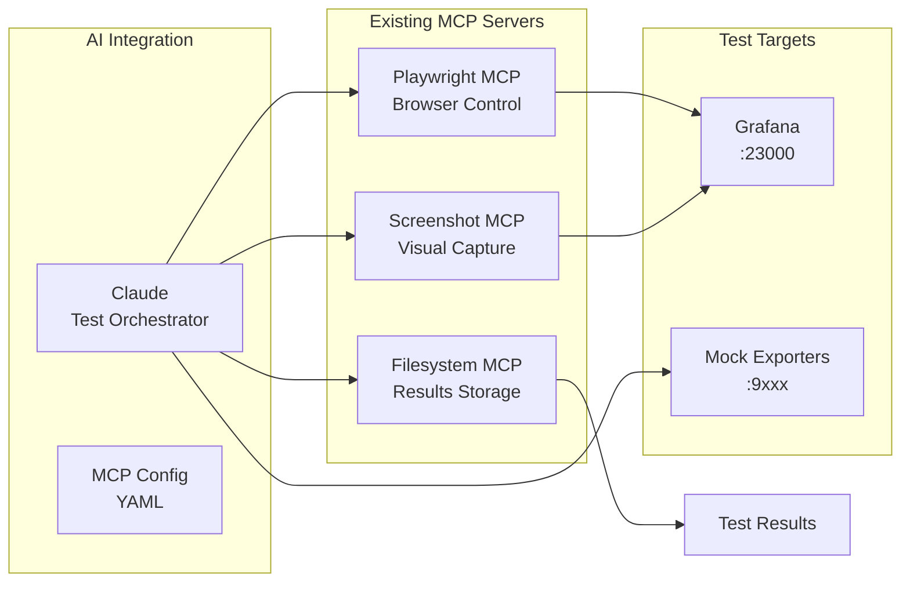

# Tech Stack

This is the definitive technology selection for the LLM Server Monitoring System. All components must use these exact specifications.

## Technology Stack Table

| Category | Technology | Version | Purpose | Rationale |
|----------|------------|---------|---------|-----------|
| Frontend Language | N/A | - | Not applicable | Grafana provides UI |
| Frontend Framework | Grafana | Latest | Dashboards and visualization | Industry standard for metrics visualization |
| UI Component Library | Grafana Panels | Built-in | Visualization components | Native Grafana components |
| State Management | N/A | - | Not applicable | Grafana handles state |
| Backend Language | Python | 3.12 | Custom exporters | Modern Python with performance improvements |
| Backend Framework | FastAPI | Latest | Exporter HTTP endpoints | Async support and automatic OpenAPI docs |
| API Style | REST | - | Prometheus metrics format | Prometheus standard |
| Database | Prometheus | 2.x | Time-series metrics storage | De facto standard for metrics |
| Cache | N/A | - | Not needed | Low request volume |
| File Storage | Docker Volumes | - | Persistent data | Container-native storage |
| Authentication | Basic Auth | - | Grafana access control | Simple and sufficient for POC |
| Frontend Testing | N/A | - | Not applicable | No custom frontend |
| Backend Testing | pytest | 8.x | Python testing | Standard Python testing framework |
| E2E Testing | Playwright | Latest | AI-driven UI testing | Headless browser automation with MCP integration |
| Build Tool | Docker | Latest | Container builds | Container-first architecture |
| Bundler | N/A | - | Not applicable | No frontend bundling |
| IaC Tool | Docker Compose | v2 | Infrastructure definition | Simple and sufficient |
| CI/CD | GitHub Actions | - | Future automation | When needed |
| Monitoring | Self | - | Self-monitoring | Dogfooding |
| Logging | Loki | 2.x | Log aggregation | Lightweight and integrates with Grafana |
| CSS Framework | N/A | - | Not applicable | Grafana themed |
| Container Registry | ghcr.io | - | Docker images | GitHub container registry |
| Config Management | Dynaconf | 3.x | Python configuration | Environment variable overrides |
| GPU Monitoring | NVIDIA DCGM | Latest | GPU metrics | Official NVIDIA solution |
| Container Metrics | cAdvisor | Latest | Docker metrics | Google's container advisor |
| System Metrics | Node Exporter | Latest | Host metrics | Prometheus standard |
| Log Shipping | Promtail | 2.x | Log collection | Loki's agent |
| AI Testing | Existing MCP Servers | Latest | Test orchestration | Using Playwright, Screenshot, and Filesystem MCP servers |
| Visual Testing | Percy | Latest | Visual regression | Screenshot comparison for dashboards |

## AI-Driven E2E Testing Architecture

The monitoring system uses existing MCP servers for AI-driven testing, avoiding custom MCP server development while maintaining powerful testing capabilities.

**Testing Stack Components:**



**MCP Configuration:**

```yaml