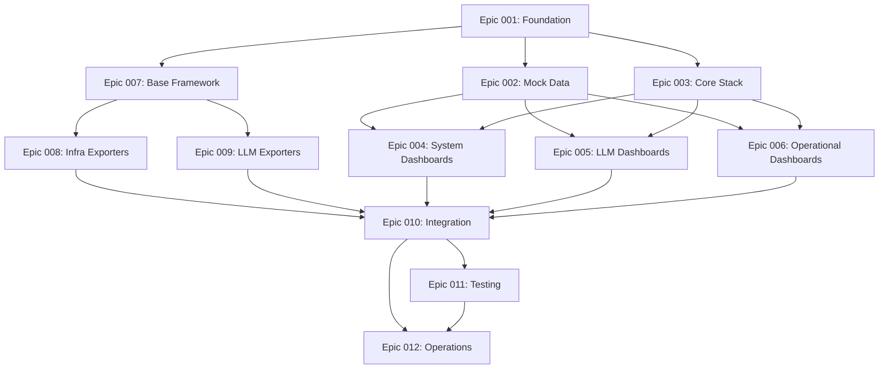

# LLM Server Monitoring System - Epic Overview

This document provides an overview of all epics for implementing the LLM Server Monitoring System. The epics are organized in phases that allow for parallel development where possible.

## Epic Summary

### Phase 1: Foundation & Mock Development (Weeks 1-3)

**[Epic 001: Project Foundation & Infrastructure Setup](./epic-001-project-foundation.md)**
- Initialize repository and development environment
- Duration: 1 week
- Priority: Critical (blocks all other work)

**[Epic 002: Mock Data Infrastructure](./epic-002-mock-data-infrastructure.md)**
- Create mock exporters for parallel dashboard development
- Duration: 1 week
- Priority: Critical (enables parallel development)

**[Epic 003: Core Monitoring Stack Deployment](./epic-003-core-monitoring-stack.md)**
- Deploy Prometheus, Loki, and Grafana
- Duration: 3-4 days
- Priority: Critical (blocks dashboards)

### Phase 2: Dashboard Development (Weeks 3-5)
*Can run in parallel with Phase 3*

**[Epic 004: Basic System Monitoring Dashboards](./epic-004-system-monitoring-dashboards.md)**
- System Health, GPU Usage, Docker Container dashboards
- Duration: 1 week
- Priority: High

**[Epic 005: LLM-Specific Dashboards](./epic-005-llm-specific-dashboards.md)**
- LiteLLM Status, vLLM Docker, Model Catalog, LangFuse dashboards
- Duration: 1.5 weeks
- Priority: High

**[Epic 006: Operational Dashboards](./epic-006-operational-dashboards.md)**
- Log Explorer, System Announcements, Performance Trends
- Duration: 1 week
- Priority: Medium

### Phase 3: Real Exporter Development (Weeks 3-6)
*Can run in parallel with Phase 2*

**[Epic 007: Base Exporter Framework](./epic-007-base-exporter-framework.md)**
- Python base framework for all exporters
- Duration: 1 week
- Priority: Critical (blocks exporters)

**[Epic 008: Infrastructure Exporters](./epic-008-infrastructure-exporters.md)**
- Node, GPU, and Container exporters
- Duration: 1.5 weeks
- Priority: High

**[Epic 009: LLM Integration Exporters](./epic-009-llm-integration-exporters.md)**
- LiteLLM, vLLM, and LangFuse exporters
- Duration: 2 weeks
- Priority: High

### Phase 4: Integration & Testing (Weeks 6-7)

**[Epic 010: System Integration](./epic-010-system-integration.md)**
- Replace mock with real exporters, validate data flows
- Duration: 1 week
- Priority: Critical

**[Epic 011: Testing & Quality Assurance](./epic-011-testing-quality-assurance.md)**
- Unit, integration, and AI-driven E2E testing
- Duration: 1.5 weeks
- Priority: High

### Phase 5: Operationalization (Week 8)

**[Epic 012: Deployment & Operations](./epic-012-deployment-operations.md)**
- Production deployment, documentation, and automation
- Duration: 1 week
- Priority: Critical

## Dependency Graph

## Key Principles

1. **Parallel Development**: Phase 2 (Dashboards) and Phase 3 (Exporters) can run simultaneously thanks to mock data infrastructure

2. **Incremental Integration**: Replace mock exporters one at a time to reduce risk

3. **Early Validation**: Mock data allows testing dashboards before real exporters are ready

4. **Quality First**: Comprehensive testing including AI-driven E2E tests

5. **Production Ready**: Full operationalization with documentation and automation

## Success Metrics

- All 12 epics completed within 8 weeks
- Zero blocking dependencies between parallel phases
- >90% test coverage on all components
- <2% monitoring overhead on production systems
- 100% dashboard compatibility between mock and real data

## Risk Management

Each epic includes specific risk mitigation strategies. Key overall risks:

1. **External API Dependencies**: Mitigated by mock implementations and fallback strategies
2. **Performance Impact**: Mitigated by optimization epics and performance testing
3. **Compatibility Issues**: Mitigated by maintaining consistent interfaces between mock and real exporters
4. **Knowledge Transfer**: Mitigated by comprehensive documentation and CLAUDE.md

## Next Steps

1. Review and approve epic definitions
2. Assign teams to Phase 1 epics
3. Set up project tracking
4. Schedule regular epic review meetings
5. Begin Epic 001 immediately